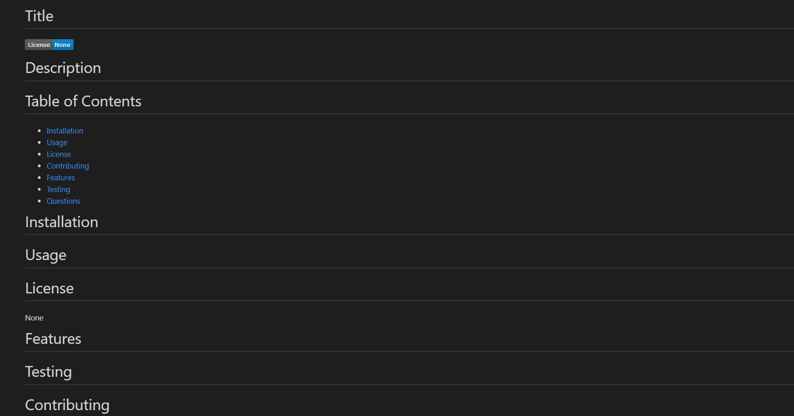

# Readme-Generator

This project is a simple command line application for generating a readme file, it accomplishes this by asking a series of questions from the command line to document your application and them generates the readme file from the information provided.

The readme file is divided into the following sections.

* Title 
* license
* Description  
* Installation
* Usage
* Features
* Testing
* Contributing 
* Questions

Below is a link to a short walkthrough video demonstrating how the application works.

[URL] (https://drive.google.com/file/d/11rrAfP9lXPPsJ6PDiZHmGKGXK0y22uWs/view)

Screen Shot 

